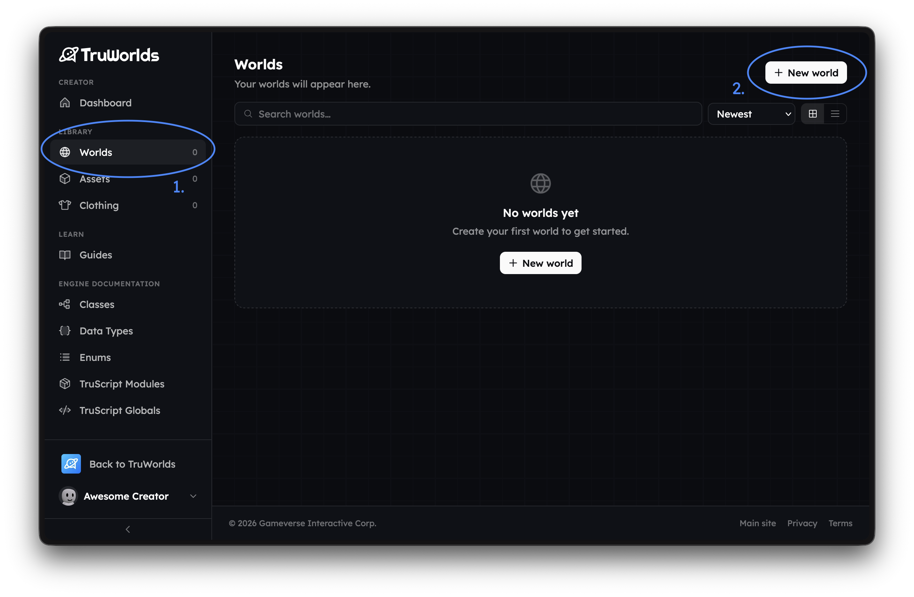
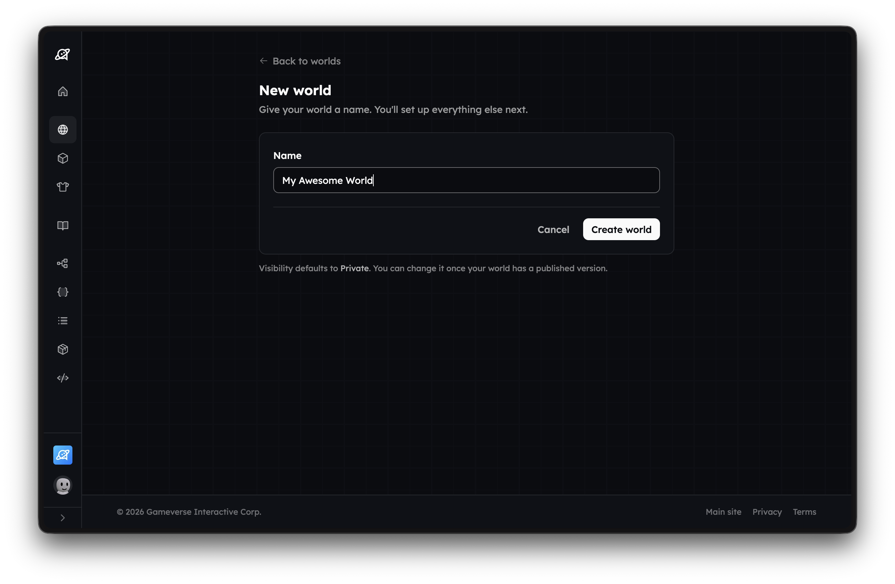
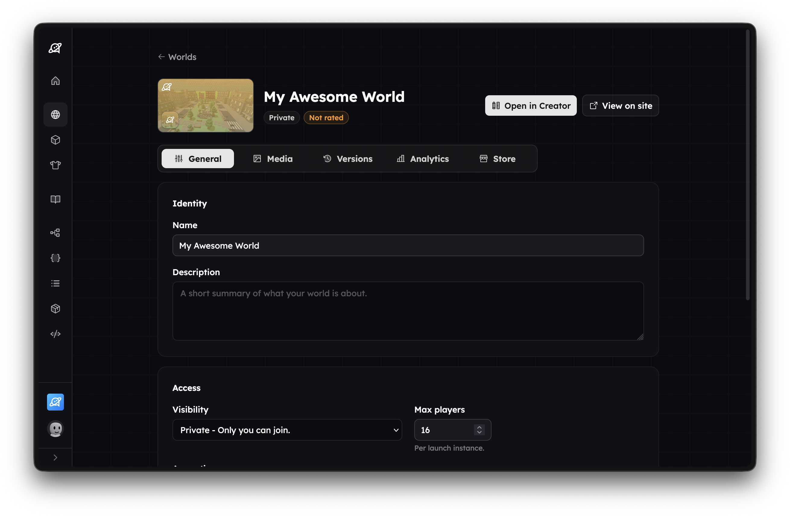

= Getting Started
:description: Install TruWorlds Creator and build your first world

Welcome to the TruWorlds documentation. Here you'll find everything you need to build, script, and publish your worlds.

== What is TruWorlds?

TruWorlds is an online multiplayer sandbox platform powered by a physics simulation game engine. Each playable experience is an interactive 3D environment called a world. This introduction series will guide you through installing the TruWorlds Creator software and building your first world.

== Downloading TruWorlds Creator

To download and install TruWorlds Creator, you need to first create a world page.

On the https://create.truworlds.com/dashboard[Create Dashboard], use the left-hand sidebar to navigate the https://create.truworlds.com/worlds[Worlds] page and click the https://create.truworlds.com/worlds/new[New world] button.

You will be asked to name your world. The name of your world is what players see on the discovery page and in-game. It can be the name of the game that your world facilitates, or a placeholder until you've decided on what you want your world to be. You can change the name of your world later at any time.

Once you create a world, you will be taken to the world management page. This is where you can manage every aspect of your world.

Next, click "Open in Creator" — this will prompt you to download and launch the TruWorlds Creator software on your computer.