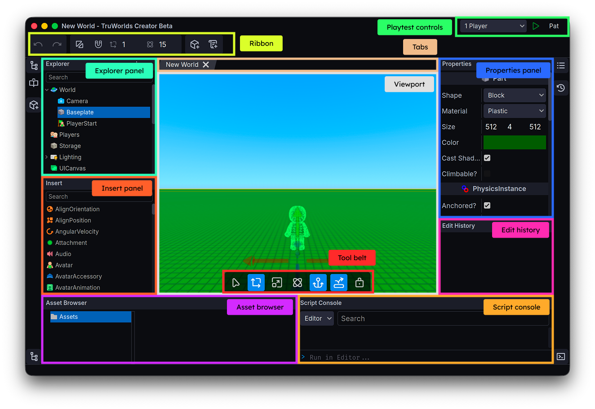

= Navigating TruWorlds Creator
:description: Explore the TruWorlds Creator interface and move your camera.

== The TruWorlds Creator interface

When you launch TruWorlds Creator and open a world, you will be taken to the primary editing screen. It should look like this:

Broken down by section:

[cols="1,1"]
|===
|Section|Usage

|Ribbon
|Global utility actions — undo/redo, enable grid snapping, change the snapping grid size, insert a Part, or create and attach a new script.

|Explorer panel
|Manage the game objects in your world in a hierarchal tree structure

|Property panel
|View and edit properties and attached scripts for selected game objects.

|Viewport
|The primary viewport into your game world or a playtest client's iwndow.

|Tabs
|Switch between the viewport, the script editor, and different playtest clients.

|Insert panel
|Create and insert new game objects into the world

|Asset browser
|Create and manage files in your world's xref:../concepts/virtual-file-system.adoc[Virtual File System]

|Script console
|View the outputs from your scripts when playtesting, or execute TruScript code inline from the command bar.

|Edit history
|Navigate your undo/redo history and traverse to a specific action.

|Tool belt
|Contextual actions that change based on what you're selecting. Change the transformation mode, anchor/unanchor selected PhysicsInstances, lock selection, etc.
|===